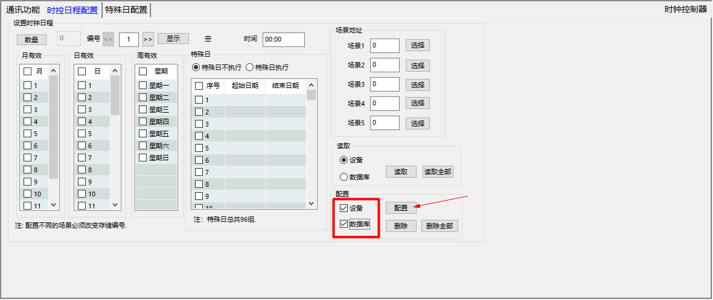

Q4_时钟相关问题

1. 问题描述：时钟控制开灯时间与实际时间有时差，且差值较大？
    * 原因：时钟模块与计算机时间未同步
    * 解决办法：在“特殊日期配置”功能中，读取“本机时间”，点击“配置” 
2. 问题描述：时钟模块配置场景以后发现未能按时执行？
    * 原因：配置时控场景时注意 **勾选**“月有效”、“日有效”、“周有效”，场景才能按指定时间定时发出。

### 注意事项
* 如果设备规模较大，数量较多，时控模块只发出一条指令，其他设备可能因为数据包过多的原因无法接受到，可以对该场景设置多个时控日程，设置2分钟的时间间隔。

---
### 1.如何配置时钟定时？
* 在设备管理中找到需要修改的时钟模块，如果时钟模块正常在线，等待读取完特殊日期后可继续进行配置。（大概等待3秒钟）
* 进入`时钟日程配置`功能

* 可选择按 *月*, *日*， *周* 执行定时功能，也可设定特殊日期选择执行或不执行。在 *场景地址*处可以设置定时时间发出去的场景号。

* 定时信息填入完成可同时勾选 `设备`、`数据库`，点击 *配置*。

### 2.时钟模块的时间同步
* 进入 *特殊日配置*功能， 先点击 *本机时间*， 再点击 *配置*。
