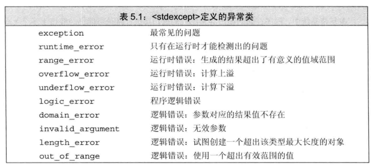

# 神奇的用法：

### #pragma

在所有的预处理指令中，#pragma 指令可能是最复杂的了，它的作用是设定编译器的状态或者是指示编译器完成一些特定的动作。#pragma指令对每个编译器给出了一个方法，在保持与C和C++语言完全兼容的情况下，给出主机或操作系统专有的特征。依据定义，编译指示是机器或操作系统专有的，且对于每个编译器都是不同的。   #pragma once   只要在头文件的最开始加入这条指令就能够保证头文件被编译一次

#ifndef，#define，#endif这个是C++语言相关，这是C++语言中的宏定义，通过宏定义避免文件多次编译。所以在所有支持C++语言的编译器上都是有效的，如果写的程序要跨平台，最好使用这种方式（被称为预处理指令）

#pragma comment

该指令将一个注释记录放入一个对象文件或可执行文件中。
常用的lib关键字，可以帮我们连入一个库文件。


# C++基础


## 一些概念：

### 宏定义：

宏，一种批量处理的称谓。

分类：

对象宏： #define PI 3.1415926

函数宏：#define MIN(A,B) A < B ？ A : B

#### 指针

指针的值（即地址）应属于下列4种状态之一：

1. 指向一个对象
2. 指向紧邻对象所占空间的下一个位置；
3. 空指针，意味着指针没有指向任何对象
4. 无效指针，上述情况之外的其他值。


### 标准异常



## 数据类型

### 向量Vector: 向量是一个具有相同类型对象的集合。与数组相比，在初定义时可以不指定大小。


### 向量 vector

**初始化vector**

``` C++
vector<T> v1;
vector<T> v2(v1);
vector<T> v2 = v1;
vector<T> v3(n, val); // 包含n个i重复元素，元素值是val;
vector<T> v4(n);  // 包含了n个重复地执行了值初始化的对象
vector<T> v5{a,b,c...} // 
vector<T> v5={a,b,c...} // 和上面等价
```


## C++ 中的一些关键字

### const 限定符

对变量类型加以限定

1. 修饰变量，变量不可以被修改；
2. 修饰指针，分为指向常量的指针和自身是常量的指针（常量指针）
3. 修饰引用，指向常量的引用，用于形参类型，避免拷贝，又避免楼函数对值的修改；
4. 修饰成员函数，说明该成员函数内不能修改成员的变量

###### const的指针和引用

* 指针
  * 指向常量的指针
  * 自身是常量指针（常量指针）
* 引用
  * 指向常量的引用
  * 没有 const reference ，因为引用本身就是const pointer

> 被 const 修饰（在 const 后面）的值不可改变

### static

作用:

* 修饰普通变量，修改变量的存储区域和声明周期，使变量存储在静态区，在main函数运行前就分配楼空间，如果有初始值就用初始值初始化它，如果没有初始值系统用默认值初始化它。
* 修饰普通函数， 表明函数的作用范围，仅在定义该函数的文件内才能使用。在多人开发项目时，为了防止与他人命名空间里的函数重名，可以将函数定位为 static。
* 修饰成员变量， 修饰成员变量使所有的对象只保存一个该变量，而且不需要生成对象就可以访问该成员。
* 修饰成员函数， 修饰成员函数使得不需要生成对象就可以访问该函数，但是在static函数内不能访问非静态成员。

### this指针

1. this指针


### inline 内联函数

1. 相当于把内联函数里面的内容写在调用内联函数处；
2. 相当于不用执行进入函数的步骤，直接执行函数体；
3. 相当于宏，比宏多了类型检查，真正具有函数特性；


### virtual 虚函数


#### 虚函数（virtual）可以是内联函数（inline）吗？

* 虚函数可以是内联函数，内联是可以修饰虚函数的，但是当虚函数表现多态性的时候，不能内联。
* 内联是在编译器建议编译器内联，而虚函数的多态性在运行期，编译器无法知道运行期调用哪个代码，因此虚函数表现为多态性时（运行期）不可以内联。

### volatile 

* volatile关键字是一种类型修饰符，用它声明的类型变量表示可以被某些编译器未知的因素（操作系统，硬件，其他线程等）更改。所以使用volatile告诉编译器不应对这样的对象进行优化。
* volatile声明的变量，每次访问时都必须从内存中取出值（没有被volatile修饰的变量，可能由于编译器的优化，从CPU寄存器中取值）
* 指针可以是 volatile

### assert（）

* 断言，是宏，而非函数。
* assert 宏的原型定义在 **<assert.h>**（C）、**<cassert>**（C++）中，其作用是如果它的条件返回错误，则终止程序执行。可以通过定义 **NDEBUG** 来关闭assert， 但是需要在源代码开头， **include <assert.h>** 之前。


### sizeof()

* 获得对象所占空间大小

### auto

是一个类型说明符，通过变量的初始值来推断变量的类型。

* auto可以在声明变量的时候根据变量初始值的类型自动为此变量选择匹配的类型，类似的关键字还有decltype

### goto

* goto 的标志符号后面的字符为**分号 (:)**

### #pragma pack(n)

* 设定结构体、联合以及类成员变量以n字节方式对齐

### memset()

* 可以对数组中的每一个元素赋同样的值

* 示例：

* ```C++
  int a[5] = {1,2,3,4,5};
  memset(a, 0, sizeof(a)); // a = {0, 0, 0, 0, 0}
  memset(a, -1, sizeof(a)); // a = {-1, -1, -1, -1, -1}
  ```

* 


### extern "C"

* 被extern限定的函数或变量是extern 类型的
* 被**extern "C"**修饰的变量和函数是按照C语言的方式编译和链接的
* **extern "C"** 的作用是让C++ 编译器将  extern "C" 声明的代码当做 C 语言代码处理，可以避免C++ 因符号修饰导致代码不能和C语言库中的符号进行链接的问题。

### struct 和 typedef struct

#### C 中

``` C 
// C
typedef struct Student
{
    int age;
}S;
// 等价于
// C
struct Student
{
    int age;
};
typedef struct Student S;
// 此时的 S 等价于 struct Student ,但是两个标识符名称空间不相同。另外还可以定义与 struct Student 不冲突的 void Student(){}
```

#### C ++ 中

###### 由于编译器定位符号的规则（搜索规则）改变，导致不同于C语言。

1. 如果在类标识符空间定义了 struct Student{...}; ,使用 Student me; 时，编译器将搜索全局标识符表， Student 未找到，则在类标识符内搜索。即表现为可以使用 Student 也可以使用 struct Student , 如下

   ``` C++
   // cpp
   struct Student
   {
       int age;
   };
   
   void f( Student me); // "struct" 关键字可以省略
   ```

2. 若定义了 与 Student 同名函数后， 则 Student 只代表函数， 不代表结构体，如下

   ``` C++
   typedef struct Student
   {
       int age;
   }S;
   void Student(){} // 定义后，Student 只代表此函数
   // void S(){} // 错误， 符号 “S”已经被定义为一个 “struct Student” 的别名
   int main()
   {
       Student();
       struct Student me; // ==> 或者 “S me”
       return 0;
   }
   ```

### C ++ 中的 struct 和 class

* struct更适合看成一个数据结构的实现体，class更适合看成是一个对象的实现体
* 区别：
  * 最本质的区别就是默认的访问控制
    * 默认的继承访问权限。struct 是public的， class是private的。
    * struct 作为数据结构的实现体，它默认的数据访问控制是public的，而class作为对象的实现体，它默认的成员变量访问控制是private的。

### union联合


### explicit （显式）关键字


### using

* using 声明 : **using namespace_name::name;**
* using 指示 : **using namespace_name name;**
* 尽量少使用 using指示（减少污染命名空间），应该多使用 using 声明，

### ::

* 分类
  * 全局作用域符（::name）
  * 类作用域符（class::name）
  * 命名空间作用域符（namespace::name）

### enum 枚举类型

``` C ++ 
// 限定作用域的枚举类型
enum class open_modes { input, output, append };

// 不限定作用域的枚举类型
enum color { red yellow, green };
enum { floatPrec=6, doublePrec=10 };
```

### decltype

* 该关键字用于检查实体的声明类型或表达式的类型及值分类。


### 引用

* 左值引用：常规引用，一般表示对象的身份

* 右值引用：右值引用必须绑定到右值（一个临时对象、将要销毁的对象）的引用，一般表示对象的值。

  右值引用可实现转移语义和精确传递，它的主要目的有两个方面：

  1. 消除两个对象交互时不必要的对象拷贝，节省运算存储资源，提高效率
  2. 能够更简洁明确地定义泛型函数

* 引用折叠

  > 引用即别名

### 宏 

* 宏定义可以实现类似于函数的功能，但是他终归不是函数，而宏定义中括弧中的“参数”也不是真的参数，在宏展开的时候对“参数”进行的是一对一的替换。

### 成员初始化列表

* 好处：
  * 更高效
  * 有些场合必须要用初始化列表


### 面向对象

##### 面向对象程序设计是种具有对象概念的程序编程典范，同是也是一种程序开发的抽象方针。

##### 面向对象的三大特征：封装、继承、多态。


## 封装

##### 把客观事物封装成抽象的类，并且类可以把自己的数据和方法只让可信的类或者对象操作，对不可信的信息隐藏。

##### 关键字：public, protected, private。不写默认为 private。

* public: 可以被任意实体访问
* protected: 只允许被子类及本类的成员函数访问
* private: 只允许被本类的成员函数、友元类或友元函数访问

## 继承

* 基类（父类）---> 派生类（子类）

## 多态

* 多态，多种状态
* 多态是以封装和继承为基础的
* C++ 多态分类及实现：
  	1. 重载多态：函数重载，运算符重载
   	2. 子类型多态：虚函数
   	3. 参数多态性：类模板，函数模板
   	4. 强制多态：基本类型转换，自定义类型转换

静态多态--》函数重载

* 同一个名字可以定义多个函数，只要这些函数的形参数量或形参类型不同就行。根据调用时所使用的实参，编译器可以自动的选择被调用的函数。**选取最佳函数的过程被称为函数匹配**（best match）

动态多态--》虚函数


## C++ 类&对象

* 类的基本思想是**数据抽象**和**封装**。数据抽象是一种依赖**接口**和**实现**分离的编程设计技术。
* 类的两项基本能力：1是数据抽象，即定义数据成员和函数成员的能力，二是封装，即保护类的成员不能被随意访问的能力。

* 以关键字class开头
* 定义了类的对象包括什么，以及可以在这个对象上执行哪些操作（即成员变量，成员函数）

## 访问数据成员

* 类对象的公共（public）数据成员可以使用直接成员访问运算符（.）来访问。
* 私有的成员和受保护的成员不能使用直接成员访问运算符（.）来直接访问。

## 类相关概念：

* 类成员函数：把定义和原型写在类定义内部的函数，就像类中的其他变量。
* 类访问修饰符：类成员可以被定义为public、private、protected。默认情况下为private。
* 构造函数&析构函数： 创建类要提供一种或几种*成员函数来控制其对象初始化的过程*，这种特殊的成员函数就是 *构造函数* 。构造函数在创建新对象时调用，析构函数在删除所创建对象时调用。
  * 构造函数的定义：
  * 构造函数的名字和类名字相同
  * 没有返回值
  * 不能声明为const
* C++拷贝构造函数：是一种特殊的构造函数，在创建对象时，是使用同一类中之前创建的对象来初始化新创建的对象。
* 友元类：在A类中声明B类是它的朋友，B类中定义A类的对象，那么在B类中通过该对象可以实现对A类私有数据的访问。

* C++友元函数：可以在类的外部通过对象使用类的私有数据成员。可以访问private和protected成员。*一般来说，最好在类定义开始或者结束前的位置中集中声明友元*
* C++ 内联函数
* C++中的this指针：每个对象都有一个特殊的指针this，指向对象本身。
* C++中指向类的指针：如同指向结构的指针。实际上类可以看成是一个带有函数的结构。
* C++类的静态成员：类的数据成员和函数成员都可以被声明为静态的。


#### 函数的返回值类型是类的引用类型，在成员函数内部可以直接使用类的数据成员。

## C++ 模板

* 模板是泛型编程的基础，泛型编程即以一种独立于任何特定类型的方式编写代码。
* 模板是编写泛型类或函数的蓝图或公式。

* 函数模板：

  * 模板函数的定义一般形式：

  * ``` c++
    template <typename type> ret-type func-name(parameter list)
    {
        // 函数主体
    }
    ```

* 类模板：

  * 类模板的一般定义形式：

  * ``` C++
    template <class type> class class-name
    {
        // 代码
    }
    ```

## C++ STL（标准模板库）

* C++ 标准模板库的核心包括以下三个组件：容器，算法，迭代器。
  * 容器：用来管理某一类对象的集合，例如deque、list、vector、map等。
  * 算法：作用于容器。提供了执行各种操作的方式，包括对容器内容执行初始化、排序、搜索和转换等操作。
  * 迭代器：用于遍历对象集合的元素。这些集合可能是容器，也可能是容器的子集。

## C++ 标准库

C++标准库包含了所有的C标准库，为了支持安全类型安全，做了一定的添加和修改

分为两个部分：

* 标准函数库：由通用的、独立的、不属于任何类的函数组成。函数库继承自C语言。（以下是分类）
  * 输入/输出 I/O
  * 字符串和字符处理
  * 数学
  * 时间、日期和本地化
  * 动态分配
  * 其他
  * 宽字符函数
* 面向对象类库：是类及其相关函数的集合。
  * 标准的C++ I/O类
  * String类
  * 数值类
  * STL容器类
  * STL算法
  * STL函数对象
  * STL迭代器
  * STL分配器
  * 本地化类
  * 异常处理类
  * 杂项支持类

### 宽字符版本的类型和函数以一个w开始。


## 顺序容器

* 顺序容器为程序员提供了控制元素存储和访问顺序的能力。
* 提供了快速顺序访问元素的能力
* 性能折中：
  * 向容器添加或从容器中删除元素的代价
  * 非顺序访问容器中元素的代价
* 顺序容器类型：
  * vector：
  * deque:
  * list:
  * forward_list:
  * array:
  * string:

## 关联容器

关联容器和顺序容器有着根本的不同：关联容器中的元素是按关键字来保存和访问的。

与之相对，顺序容器中的元素是按它们在容器中的位置来顺序保存和访问的。

类型分类：

> 有序

* map：key-value
* set：关键字即值
* multimap: 关键字可以重复出现的map
* multiset: 关键字可以重复出现的set

> 无序关联容器

* unordered_map
* unordered_set
* unordered_multimap
* unordered_multiset


### 容器操作-》类型别名 -> const_iterator：可以读取元素，但不能修改元素的迭代器类型。

## 获取迭代器

* c.begin(), c.end() : 返回指向c的首元素和尾元素之后位置的迭代器
* c.cbegin(), c.cend() :返回 const_iterator

## C++ 4种编程风格：

* C风格
* 基于对象
* 面向对象
* 泛型
* “基于组件”的风格


## 动态内存与智能指针：


# C语言

自由的代价永远是警惕。


# 基础十问

1、C与C++的关系是什么？

C是C++ 的一部分，C++是C的超集。

2、面向对象与C++的关系是什么？


3、面向对象的方法与面向对象编程的关系是什么？


4、面向对象编程的优势（优点、特性）是什么？


5、什么是对象，什么是类，它们的关系如何？


6、类的定义、初始化、赋值、构造和析构的具体操作方法。成员、方法、const 和this指针。


7、重载与类模板的使用。类继承、多重继承的方法。


8、什么是多态性，C++如何实现？


9、如何在C++面向对象编程中体现“数据抽象”？


10、如何用OOP实现更好的数据封装与代码重用？