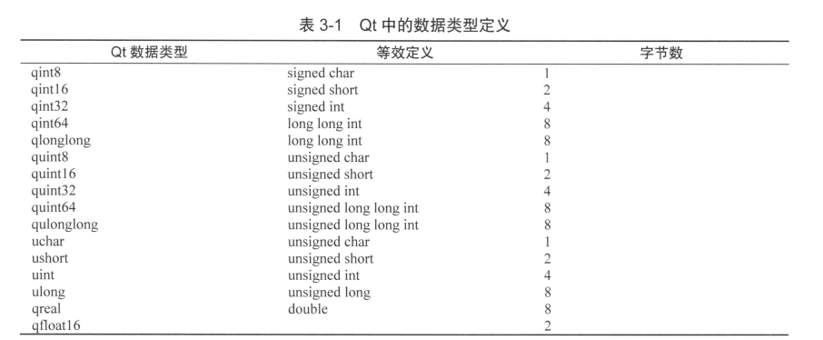

# Q对象

### QT 窗口类

QWidget：所有用户接口对象的基类

最上层的widget（top-level widget）是一个独立的窗口，有`setWindowTitle()`和`setWindowIcon()`来设置标题和图标

QListWidgetItem

QListWidgetItem表示QListWidget中的单个项目。 每个项目可以容纳几条信息，并将适当地显示它们。

### 文件操作类

QDir

可以访问目录和文件

QFileInfo：返回符号链接指向的文件或目录的绝对路径；如果对象不是符号链接，则返回空字符串。

* QFileInfoList

### 串口通讯相关

QSerialPort：提供访问串口的方法。可以枚举系统中的所有串口，帮助获取可用的串口，通过setPort()或setPortName()方法，分配所需的串口设备。

QSerialPortInfo：提供可用串口的信息

QIODevice：在QT中所有I/O设备的基本接口类

### 消息事件

QShowEvent：提供了显示小部件时发送的事件

显示事件有两种：

* 窗口系统（自发）引起的显示事件 [QEvent::spontaneous](../qtcore/qevent.html#spontaneous)()
* 内部显示事件

自发事件在窗口系统显示窗口之后立即发送；在图标化后重新显示顶级窗口时，也会发送它们。 内部显示事件在窗口小部件变得可见之前传递

### 线程相关

QMutexLocker：简化了互斥锁的锁定和解锁

QThread：提供了一种独立于平台的方式来管理线程。

### 数据类型

QString：提供unicode 字符集的字符串

* trimmed() //去掉首尾的空格
* simplefied() // 去掉首尾，及中间连续的空格用一个空格替换。

QByteArray：提供字节数组

QTextCursor：提供一个API访问和修改QTextDocuments

QTextDocument：保存格式化文本

QList： 数组列表

* inert()
* replace()
* removeAt()
* move()
* swap()
* append()
* prepend()
* removeFisrt()
* removeLast()
* 下标索引，或者 at() 函数

QLinkedList:

QVector: QVector的函数接口和QList几乎完全相同，QVector<T> 的性能比 QList<T>更高，因为前者的数据项是连续存储的。

QStack:

QQueue:

QStringList

### 关联容器：

QMap

QHash:

QSet:

QVariantHash:

QVariantList:

QVariantMap:Synonym for [QMap](qmap.html)<[QString](qstring.html), [QVariant](qvariant.html)>.

# Q控件

QLabel:

继承关系：QObject->QWidget->QFrame->QLabel


# 一些用法：

qRegisterMetaType：在信号槽中自定义类型，用qRegisterMetaType对自定义类型进行注册。

使用方法：

1. 注册位置：在第一次使用此类链接跨线程的signal/slot之前，一般在当前类的构造函数中进行注册；
2. 注册方法：在当前类的顶部包含 `#include<QMetaType>`,构造函数中加入代码：`qRegisterMetaType<MyClass>("MyClass");`
3. Myclass的引用类型需单独注册：`qRegisterMetaType<MyClass>("MyClass&");`

Q_NULLPTR

c_str()

#### 中文字符输出

**qDebug**() << str.**toStdString**().**c_str**();


```c++
QString data = QString("%1 %2 %3 ").arg(“1”)
            .arg(“2”).arg(“3”);
// .arg()完成字符串的格式化
// .arg(str, length) 所接受的第二个参数，可代表所占宽度
```

#####  用于显示中文的宏

``` C++
#define tr(s) (QString::fromLocal8Bit(s)) // tr为自定义
```

##### 静态函数在给给定时间后执行

用法：`QTimer::singleShot(2*1000, this, &updateGateway::on_pBtn_sendOrder_clicked);`

###### QByteArray 转换为`char * `类型
```C++
QByteArray array;
char *pt = reinterpret_cast<char *>(array.data());
```

# QT Cteator

### 编辑器快捷键


### 数据类型定义




# socket编程

ReadyRead()信号：

### Windows下Qt使用htons, htonl, ntohs, ntohl

1. `pro文件`加上：`LIBS += -lws2_32` 
2. 源代码包含头文件：`#include <winsock2.h>`

[【socket编程为什么需要htons(), ntohl(), ntohs()，htons() 函数】](https://blog.csdn.net/Kk_01110001B/article/details/90731792)


## toggled 与 triggered 信号的区别

* toggle在实物上有开关的意思，两头表示两个状态：开和关。
  * 使用该信号的控件需要将setCheckalbe属性设置为true;
* trigger 有触发的意思，一次性的，点击后无法改变状态。

