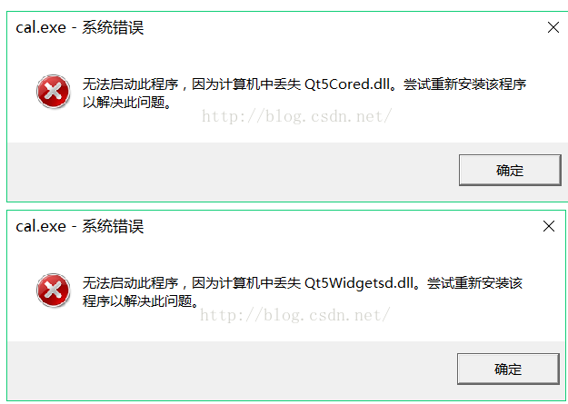

### 记录软件

## 在Visual Studio中

## 重新生成方案出错的问题

```Shell
1>Release\crc.obj : warning LNK4042: 对象被多次指定；已忽略多余的指定
1>UpdateTool.obj : error LNK2001: 无法解析的外部符号 "unsigned short __cdecl Cal_CRC16(char const *,unsigned int)" (?Cal_CRC16@@YAGPBDI@Z)
1>F:\MRCLSW\MRCLSW_SVN\Release\MRCLSW.exe : fatal error LNK1120: 1 个无法解析的外部命令

// 解决办法，源码目录删除'crc.obj'文件，再重写生成
```

## 不允许指针指向不完整的类类型

* 未引入引用类头文件
* 引用类声明出错


## Qt Creator 中

项目路径切换，或文件夹重新命名后，执行编译路径出错：

1. 在该项目执行 qmake  重新生成编译文件 MakeFile
2. 再执行编译


## Qt项目软件打包发布，安装包运行安装完成后程序运行出现缺少dll文件的问题？

##### 比如像这样的错误：



**解决办法**

* 思路：配置QT的环境变量
* [参考文章](https://blog.csdn.net/qq_17346105/article/details/51497585)