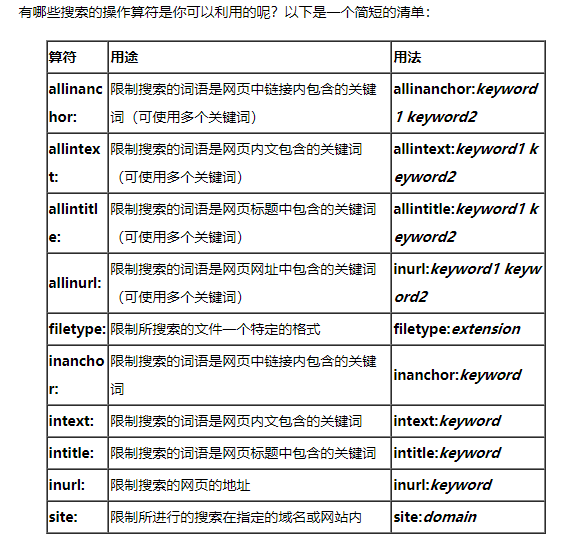

# 利用搜索引擎搜索技巧

## 准确搜索

"Apple 苹果"

对关键词加双引号处理

不加双引号，只加空格，搜索引擎会分别搜索这两个词

## 逻辑非  排出关键词

"Apple 苹果" -水果

用减号对指定内容进行排除

##  逻辑与 进行搜索, 也可以用空格表示

`苹果 AND Apple =》 苹果 Apple`

## 逻辑或

`苹果 OR Apple`

可以得到和两个关键词分别相关的结果，而不仅仅是和两个关键词同时相关的结果。

## 同义词搜索 ~

北京 ~大学

在未能准确判断关键词的情况下，可以通过~进行同义词搜索

## 站内搜索

Python  site:pan.baidu.com

前提是搜索引擎收录有该网站的资源，否则也是搜索不到的

## 善用 * 星号

*星号填补缺失部分的内容

## 两个数值之间进行搜索

数值之间的符号是两个英文句号加一个空格

## 在网站标题，内容，URL中搜索关键词
intitle: 后台登录
inbody: 注册
inurl: .cn

## 搜索相关网站
related: zhihu.com

搜索到的页面与特定的页面在某些方面是相似的。

## 针对文件类型搜索

filetype:pdf  learn C++

支持的格式有：

- Adobe Portable Document Format (.pdf)
- Adobe PostScript (.ps)
- Autodesk Design Web Format (.dwf)
- Google Earth (.kml, .kmz)
- GPS eXchange Format (.gpx)
- Hancom Hanword (.hwp)
- HTML (.htm, .html, other file extensions)
- Microsoft Excel (.xls, .xlsx)
- Microsoft PowerPoint (.ppt, .pptx)
- Microsoft Word (.doc, .docx)
- OpenOffice presentation (.odp)
- OpenOffice spreadsheet (.ods)
- OpenOffice text (.odt)
- Rich Text Format (.rtf)
- Scalable Vector Graphics (.svg)
- TeX/LaTeX (.tex)
- Text (.txt, .text, other file extensions), including source code in common programming languages:
  - Basic source code (.bas)
  - C/C++ source code (.c, .cc, .cpp, .cxx, .h, .hpp)
  - C# source code (.cs)
  - Java source code (.java)
  - Perl source code (.pl)
  - Python source code (.py)
- Wireless Markup Language (.wml, .wap)
- XML (.xml)

## 快速搜索

* 查单词定义，`define: CSS`
* 查找内容包含某个关键词的页面，例如 `intex:ucloud`

