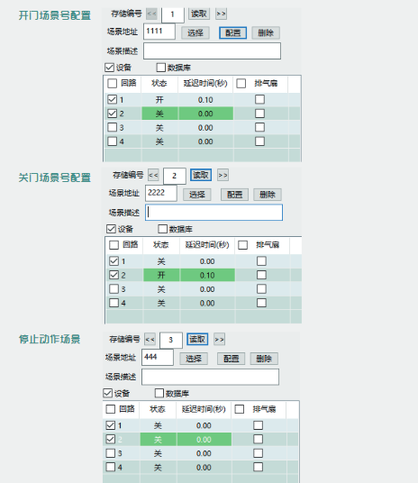
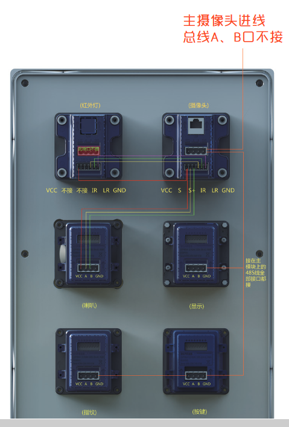
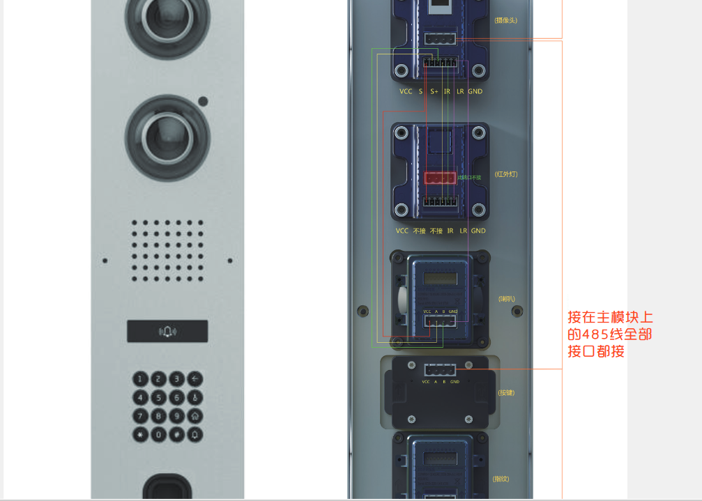
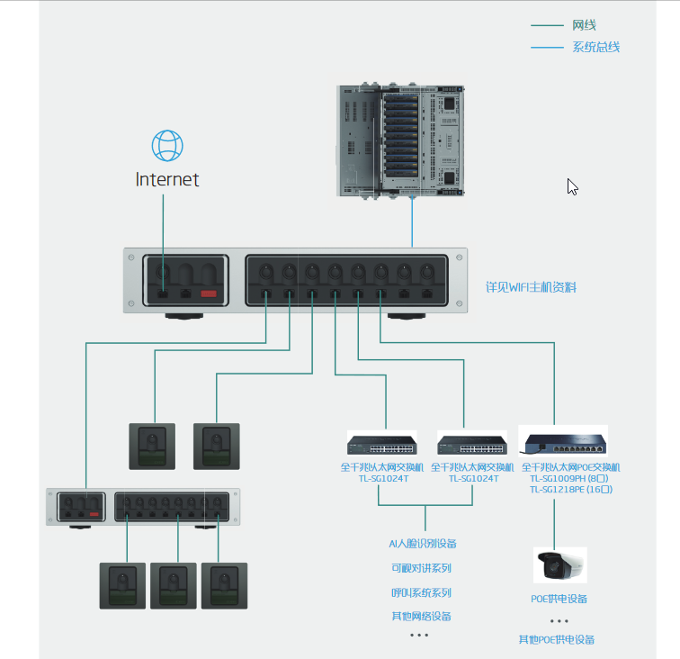

产品学习
---

## PKE系统：
### 停车库管理系统

### 组件：138网关，开关控制模块，1.5m/5m光栅，红外对射，PKE基站，无线钥匙，按键面板独立指纹模块。

#### 无线钥匙
* 数量可多个，但最多10个
* 两个按键，open，close
* 在基站配对序列号之后，长按5秒两个按键可进行配对

#### 开关模块
* 用于控制车库开关
* 需配置3个场景号，开门，关门，停止动作
* 开关模块场景号配置需和基站联动设备里面场景号一致
* 停止动作场景必须和红外对射的开场景号一致，每个场景号需同时控制两个回路；
    - 两个回路不能同时打开，开的回路设置一点延时
    - 

#### 四键面板
* 手动，自动，开门，关门
* 软件配置，设备类型为：六键控制面板（Hotel版）

#### 指纹识别模块
* 功能：切换手动，自动模式
* 指纹识别结果1分钟内有效，1分钟后失效

#### 光栅
* 检测车位是否停有车辆

#### 红外对射
* 防夹功能

---

## 可视对讲
### 包含的设备：sip服务器，室外机，室内机，呼叫面板
* 门口机A款：
    - 
* 门口机B款：
    - 

---
# 网络系统说明

---
# 遥控器
* 分类：温控调光款，温控款，调光款
* 需要基站支持，可墙面安装，可面板，可吸顶

---
# 爱识别APP-可视对讲室外机模块注册

---
# 爱识别APP——单体模块操作

---
# 海康威视摄像头操作
* 电脑安装SADP软件(海康威视官网下载)，运行软件自动搜索局域网内设备
* 勾选未激活设备激活
* 进入硬盘录像机配置界面
* IISFREE APP 添加摄像头
    - 网络配置 ——》 基本配置 ——》平台接入 ——》 接入类型“萤石云” ——》 扫描二维码即可(PS: 必须状态 在线)

